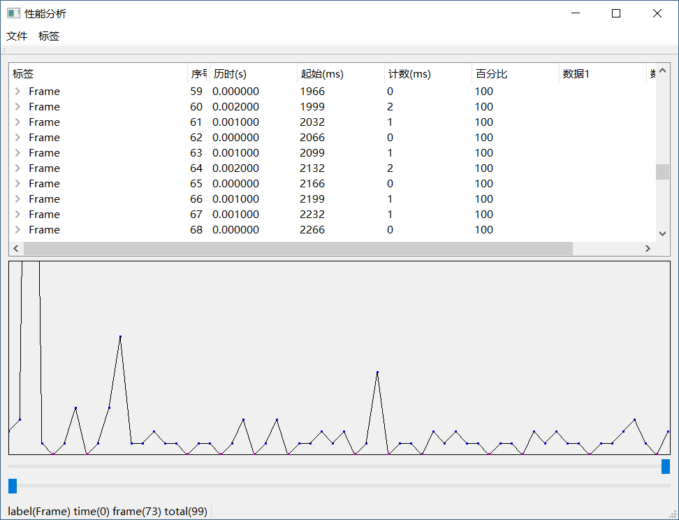

# Perfview
记录代码中标记过的时间戳，显示多个连续帧的性能数据。使用Qt5构建。

# Usage
1、#include <runtime/Perfstamp.h> 
2、To call StartPerfSampler(outputfilename,MAX_STAMP_BUFFER) to initialize the time stamp sampler.
3、In each target thread to profile，to call PERF_BEGIN_FRAME()/PERF_END_FRAME()
4、In code segment of target thread to profile, call PERF_BEGIN(Label)/PERF_END(Label) to record the time stamp with label，the Label must be const string
5、You all can PERF_END_DATA(Label,Data1,Data2) to replace PERF_END(Label) to record more data infomation
6、PERF_TAG(Label,dt) /PERF_TAG_DATA(Label,dt,Data1,Data2)  can be called individually to add a record of Label-deltaTime in a frame.
7、PERF_STAMP(Label,Type)/PERF_STAMP_FUL(Label,Type,__FILE__,__FUNCTION__,__LINE__)/PERF_STAMP_DATA(Label,Type,Data1,Data2)  is used to implement macros above. the parm Type can be one of thease: PERF_TYPE_BEGIN,PERF_TYPE_END,PERF_TYPE_TAG

